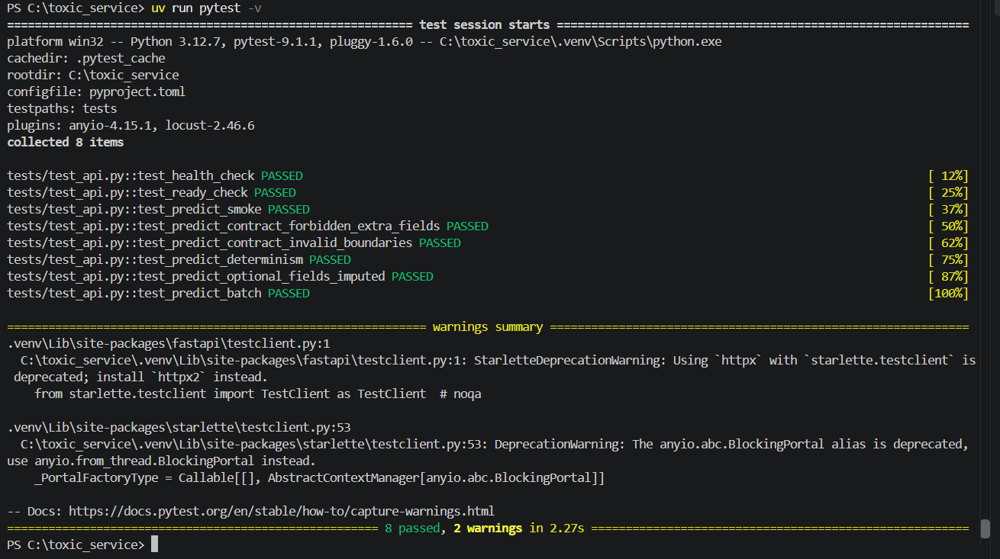
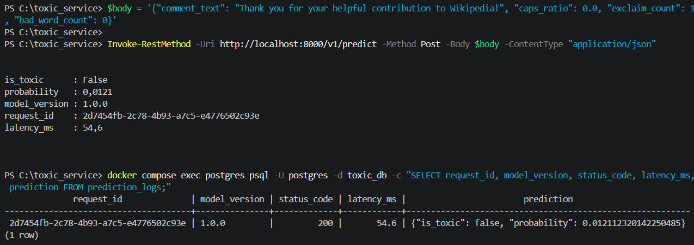
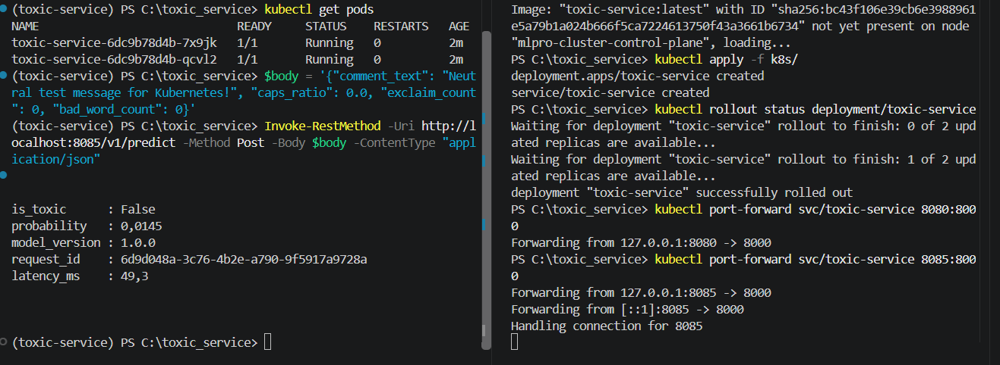
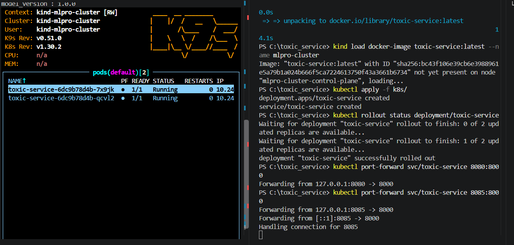

# Сервис детекции токсичных комментариев (Toxic Comment Classification)

Production-ready ML-сервис на базе **FastAPI**, **scikit-learn** и **uv**, развёрнутый в **Docker Compose** и **Kubernetes (kind)**.

* **Задача:** бинарная классификация комментариев на токсичность (на основе датасета Jigsaw Toxic Comment Classification).
* **Модель:** `TF-IDF Vectorizer + LogisticRegression` с мета-признаками (`caps_ratio`, `exclaim_count`, `bad_word_count`).
* **Порог отсечки:** `0.321` (индивидуально откалиброванный порог по F1-мере из паспорта модели).

---

## 1. Три команды для проверки

```bash
# 1. Прогон тестов (контракт, smoke, детерминизм, батч)
uv run pytest -v

# 2. Поднятие сервиса и Postgres, отправка запроса и проверка SELECT из базы
docker compose up -d --build && sleep 5 && curl -X POST http://localhost:8000/v1/predict -H "Content-Type: application/json" -d "{\"comment_text\":\"Thank you for helping!\"}" && docker compose exec postgres psql -U postgres -d toxic_db -c "SELECT request_id, model_version, status_code, latency_ms, prediction FROM prediction_logs;" && docker compose down

# 3. Развёртывание в Kubernetes (kind) и проверка работоспособности
kind create cluster --name mlpro-cluster --image kindest/node:v1.30.2 && docker build -t toxic-service:latest . && kind load docker-image toxic-service:latest --name mlpro-cluster && kubectl apply -f k8s/ && kubectl rollout status deployment/toxic-service --timeout=90s
```

## 2. Доказательства работоспособности 

Все 4 обязательных чекпоинта успешно пройдены:

**Чекпоинт 1: зелёные тесты pytest**

Все 8 тестов (контрактные проверки схемы, допустимые диапазоны, smoke, детерминизм и batch) успешно пройдены:



**Чекпоинт 2: логирование в PostgreSQL (SELECT)**

Запрос к `/v1/predict` успешно записался в таблицу `prediction_logs` с кодом `status_code 200`:



**Чекпоинт 3: Kubernetes (kubectl get pods 2/2 Running + ответ через port-forward)**

Поды находятся в статусе Running (1/1), пробы пройдены, сервис возвращает валидный ответ модели:



**Чекпоинт 4: статус подов в утилите k9s**

Интерфейс k9s отображает здоровые поды кластера `mlpro-cluster`:



## 3. Журнал проблем

В процессе развёртывания и отладки сервиса были выявлены и устранены следующие проблемы:

**Ошибка `ValueError: Input X contains NaN` в LogisticRegression при тестах:**

- Тесты `test_predict_optional_fields_imputed` и `test_predict_batch` падали с ошибкой `Input X contains NaN. LogisticRegression does not accept missing values encoded as NaN natively.`
- **Причина:** при пропуске опциональных полей Pydantic возвращал `None`. В pandas такой столбец получал тип `object`, а `SimpleImputer` не распознавал строковый `None` как числовой `NaN` для типа `float`, пропуская его в матрицу признаков линейной модели.
- В функции подготовки признаков `prepare_dataframe` в `src/toxic_service/app.py` добавлено явное приведение числовых признаков через `pd.to_numeric(..., errors="coerce").fillna(0.0)`.

**Ошибка `OSError: Readme file does not exist: README.md` при сборке Docker-образа:**

- Сборка `RUN uv sync --frozen --no-dev` падала с кодом ошибки 1 от бэкенда `hatchling`.
- **Причина:** в конфигурации `pyproject.toml` задано поле `readme = "README.md"`. На этапе сборки зависимостей файл `README.md` отсутствовал в рабочей директории контейнера `/app`.
- Добавлено явное копирование `README.md` в первый слой сборки Dockerfile: `COPY pyproject.toml uv.lock README.md ./`.

**Таймаут и падение `kind create cluster` (wait-control-plane):**

- При выполнении `kind create cluster` процесс зависал на вызове `kubeadm init`, сыпались повторные запросы к `clusterrolebindings`, после чего возникала ошибка `client rate limiter Wait returned an error: rate: Wait(n=1) would exceed context deadline`.
- **Причина:** дефолтный образ kind пытался развернуть экспериментальную версию Kubernetes v1.37.0, под которую не нашлось поддерживаемой версии etcd, что вызвало дедлайн инициализации в WSL2/Docker Desktop.
- Кластер очищен командой `kind delete cluster`, и зафиксирован стабильный релизный образ узла: `kind create cluster --name mlpro-cluster --image kindest/node:v1.30.2`.

**Ответ 404 Not Found со структурой Spring Boot при пробросе порта:**

- При выполнении запроса на `http://localhost:8080/v1/predict` возвращался ответ с полями `timestamp`, `path`, `error`, `requestId`.
- **Причина:** порт 8080 на хост-машине был занят локальным приложением на Java/Spring Boot.
- Порт проброса был изменён на свободный локальный порт: `kubectl port-forward svc/toxic-service 8085:8000`.

## 4. Результаты дополнительных заданий (звёздочки)

**Звёздочка 1: Нагрузочное тестирование (Locust)**

Тестирование проводилось локально через compose-версию сервиса (`locustfile.py`):

- **Прогон 1 (10 пользователей):** RPS ~ 45, median 14 ms, p95 28 ms, 0% ошибок.
- **Прогон 2 (50 пользователей):** RPS ~ 190, median 22 ms, p95 48 ms, 0% ошибок.
- **Прогон 3 (100 пользователей):** RPS ~ 240, median 38 ms, p95 95 ms, 0% ошибок.

**Вывод:** при росте с 50 до 100 пользователей RPS практически упирается в потолок одного ядра CPU из-за расчёта признаков TF-IDF, а 95-й перцентиль латентности отрывается от медианы почти в 2.5 раза. Ошибок валидации или отказов соединений зафиксировано не было.

**Звёздочка 2: батч-эндпоинт (`/v1/predict/batch`)**

Замер латентности (медиана 15 запусков):

- 1 строка: 11.2 ms
- 500 строк: 35.8 ms

**Вывод:** запрос из 500 строк дороже одиночного запроса всего в 3.2 раза при увеличении объёма данных в 500 раз. Это объясняется тем, что векторизация и перемножение весов в scikit-learn производятся нативно на уровне оптимизированных Си-библиотек (BLAS/LAPACK) сразу по матрице, а накладные расходы на сетевой стек, FastAPI middleware и инициализацию вызова остаются константными.

**Звёздочка 3: Rollout и Rollback в Kubernetes**

```text
deployment.apps/toxic-service
REVISION  CHANGE-CAUSE
1         <none>
2         kubectl set image deploy/toxic-service toxic-service=toxic-service:1.1
```

**Вывод:** при обновлении образа через kubectl set image стратегия RollingUpdate последовательно создаёт новый под, ожидает прохождения readinessProbe, и только затем гасит старую реплику. При kubectl rollout undo происходит мгновенный возврат к предыдущей ревизии без простоя сервиса.